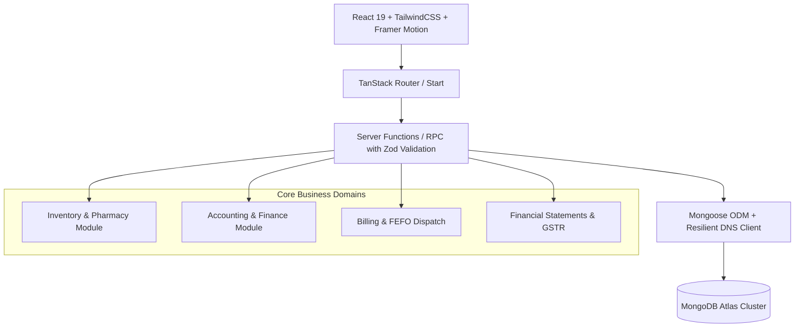

# Current System Analysis Report: Harmony ERP Suite

> **Document Version**: 1.0  
> **Repository**: `harmony-erp-suite`  
> **Stack**: TanStack Start / Vite, React 19, TypeScript, TailwindCSS, MongoDB / Mongoose, Server Functions (RPC)  
> **Purpose**: Comprehensive technical audit of the current state of Harmony ERP Suite, detailing all active modules, database models, accounting engines, inventory workflows, and integration readiness.

---

## 1. System Architecture & Technology Stack



### Core Architecture Components
1. **Frontend Layer**:
   - Built on **React 19** and **TanStack Router / TanStack Start**.
   - Styled with a unified medical/clinical ERP design system using **TailwindCSS**, custom semantic tokens (HSL variables), and **Framer Motion** for micro-interactions.
   - Comprehensive state stores (e.g. `useInventoryStore.ts`) providing local reactivity with persistent cloud sync.

2. **Backend / Server Function Layer**:
   - Fully typed RPC Server Functions (`createServerFn`) powered by `@tanstack/start`.
   - Strict input validation on all payloads using **Zod** schemas.
   - Zero-leak serialization with cross-JSON sanitization.

3. **Database Layer (MongoDB Atlas)**:
   - Resilient connection client in `client.ts` with custom DNS resolvers (`8.8.8.8`, `1.1.1.1`) to eliminate Windows SRV lookup timeouts (`querySrv ETIMEOUT`).
   - Self-healing atomic counter generator (`counters.ts`) with `$max` synchronization to prevent duplicate key collisions (`M-0010` $\to$ `M-0011+`).
   - Mongoose 8+ compliant query options (`returnDocument: "after"`).

---

## 2. Detailed Module Breakdown & Current Capabilities

### A. Inventory & Pharmacy Module (`src/components/erp/inventory/`)

The Inventory domain handles clinical pharmaceuticals, consumables, batch logistics, and point-of-sale dispatch:

| Feature / Sub-view | Component File | Description & Current Capabilities |
| :--- | :--- | :--- |
| **Item Master Catalog** | `StockView.tsx` | Search, category filtering, stock health badges (In Stock, Low Stock, Critical, Expired). Auto-sequenced item codes (`M-0001` to `M-0010+`). |
| **Item Detail Master** | `ItemDetailView.tsx` | Comprehensive item overview with left metadata sidebar (Assign Doctor, Attach COA/MSDS documents, Tagging, Favorites/Bookmark, Print Sheet). |
| **Batch & GRN Tracking** | `ItemInventory.tsx` | Multi-batch list with individual expiry dates, quantities, and inward costs. Interactive **Add Batch / GRN** form saving directly to MongoDB. |
| **Dynamic Item Variants** | `ItemVariants.tsx` | Live formulation, dosage strength, and packaging variant creator (`handleCreateVariant`) with instant deletion. |
| **Territory Tax Rules** | `ItemTax.tsx` | GST rate assignment (`5%`, `12%`, `18%`, `28%`) with custom state/territory and SEZ export tax overrides. |
| **Quality Control (QC)** | `ItemQuality.tsx` | Clinical inspection logs (e.g., *Incoming GRN Gate Inspection*, *Cold Chain Check*), checklist criteria, and pass/fail audit logs. |
| **Warehouse Movements** | `StockLedger.tsx` | Dual-warehouse tracking (`Main Pharmacy` vs `Emergency OPD Store`), inter-warehouse stock transfers with verification. |
| **Billing & POS Sync** | `BillingSync.tsx` | Real-time counter sales simulation. Automatically performs **First-Expiry-First-Out (FEFO)** batch decrementing. |

---

### B. Accounting & Finance Module (`src/components/erp/accounting/`)

A full double-entry financial suite compliant with Indian Accounting Standards (Ind AS) and GST regulations:

#### 1. Financial Dashboard (`FinancialDashboard.tsx`)
* **Period Switcher**: Instant switching between `Month to Date (Aug 2026)`, `Q1 FY 2026–27 (Apr–Jun)`, and `Full Year (FY 2026–27)`.
* **Dynamic KPIs**: MTD Net Revenue, Total Expenses, Cash & Bank Balance, GST Payable with trend indicators.
* **Interactive Visualizations**:
  * Monthly Profit & Loss bar chart (Income vs Expense vs Net Profit).
  * 30-Day Cash Flow line chart (Incoming cash receipts vs Outgoing vendor disbursements).
* **Setup & Audit Checklist**: Step-by-step onboarding tracker linking directly to relevant accounting sub-modules.

#### 2. Chart of Accounts & General Ledger (`ChartOfAccounts.tsx`)
* **Hierarchical Tree View**: Expandable/collapsible account hierarchy (`1000 Assets`, `2000 Liabilities`, `3000 Equity`, `4000 Income`, `5000 Expense`).
* **Live Account Creator**: Dialog allowing creation of group or leaf ledger accounts directly in MongoDB.
* **Double-Entry Journal Engine**:
  * Real-time debits vs credits discrepancy calculation.
  * Blocks unbalanced entries and saves validated journals with auto-generated `JV-XXXX` sequence IDs.
* **Balanced Trial Balance**:
  * **Debits**: Assets (₹32.70L) + Expenses (₹9.20L) = **₹41.90L**
  * **Credits**: Liabilities (₹4.20L) + Equity (₹16.10L) + Income (₹21.60L) = **₹41.90L**
  * Equilibrium validated: **Diff: ₹0.00** with green status badge.

#### 3. Receivables & Payables (`ReceivablesPayables.tsx`)
* **Payment Entry Dialog**: Records incoming customer receipts (`Receive`) and outgoing vendor payments (`Pay`) with auto-generated `PE-XXXX` codes in MongoDB.
* **Invoice Allocation**: Settles specific sales and purchase invoices against recorded payments.
* **Aging Analysis**: Automatic aging breakdown across 4 buckets: `0–30 Days`, `31–60 Days`, `61–90 Days`, and `90+ Days (Overdue)`.

#### 4. Banking & Reconciliation (`BankingReconciliation.tsx`)
* **Bank Master**: Live bank account balances fetched from MongoDB assets/bank GL accounts.
* **Statement File Import**: Uploads `.csv`, `.ofx`, and `.qif` bank statements directly into the reconciliation ledger.
* **Reconciliation Matcher**: Interactive check-to-match ledger entries against statement lines with balanced difference posting.

#### 5. Taxation & Compliance (`TaxationCompliance.tsx`)
* **GSTR-1 JSON Generator**: Generates and downloads standard GST Portal-compliant JSON files (`GSTR1_082026.json`) containing B2B invoice tables and B2C summaries.
* **GST & Tax Templates**: Configures CGST, SGST, IGST, and Cess percentage splits with default template assignment.

#### 6. Budgeting & Cost Centers (`BudgetingCostCenters.tsx`)
* **Budget Tracker**: Fiscal year annual budgets with quarterly and monthly distribution schedules and overage rules (`Warn`, `Stop`, `Ignore`).
* **Cost Center Allocations**: Departmental expense allocations (`OPD`, `Pharmacy`, `Surgery`, `Inpatient`) with 100% sum validation.

#### 7. Financial Statements & Reports (`FinancialReports.tsx`)
* **Profit & Loss Statement (P&L)**: Revenue from operations, Cost of Goods Sold (COGS), Operating expenses, and Net Profit (EBITDA).
* **Balance Sheet**: Assets vs Liabilities & Equity with verified 100% mathematical equilibrium.
* **Cash Flow Statement**: Direct method breakdown of Operating, Investing, and Financing cash movements.
* **Trial Balance Audit View**: Full searchable general ledger exportable to **CSV** and **Print**.

---

## 3. Database Schema Overview (MongoDB Models)

```
├── InventoryItem      -> itemCode, name, brand, category, dosageForm, uom, reorderLevel, gstRate, defaultSalePrice
├── StockBatch         -> itemCode, batchNo, mfgDate, expDate, inwardQty, currentStock, purchasePrice, mrp
├── GLAccount          -> code, name, type (Assets/Liab/Equity/Income/Exp), subtype, parent, openingBalance, currency
├── JournalEntry       -> journalNo (JV-XXXX), date, voucherType, lines [{ account, debit, credit }], narration
├── PaymentEntry       -> paymentNo (PE-XXXX), paymentType, partyType, partyName, modeOfPayment, paidAmount, references
├── Budget             -> budgetNo, fiscalYear, costCenter, lines [{ account, annualBudget, monthly }]
├── TaxTemplate        -> name, appliesTo, rows [{ taxType, rate, account }]
├── Counter            -> key (e.g. inventory_item, journal_entry, payment_entry), seq
└── ErpRow             -> Generic synchronized ERP collection with optimistic concurrency
```

---

## 4. Gap Analysis: Current System vs. Legacy VetSync

| Functional Area | Current Harmony ERP Suite | Legacy VetSync System | Next Planned Integration |
| :--- | :--- | :--- | :--- |
| **Double-Entry Accounting** | ✅ Full GL, P&L, Balance Sheet, Trial Balance, Journals | ⚠️ Simple single-entry Cash Book only | Current system is superior; keep full double-entry engine. |
| **GST Compliance** | ✅ Live GSTR-1 JSON export, tax templates, CGST/SGST/IGST | ⚠️ Basic Bill Type flag (`GST` / `Non-GST`) | Keep full GSTR-1 generator; support `Non-GST` receipt layout. |
| **Batch Logistics & FEFO** | ✅ Dynamic multi-batch FEFO dispatch with auto-allocation | ⚠️ Manual batch selection during billing | Current FEFO auto-allocation is superior. |
| **Clinical Invoicing Reminders** | 🔄 Standard POS Invoice layout | ✅ Header reminders: `Next Visit`, `Next Vaccine`, `Next Deworming` | **Apply to Harmony ERP billing form and print receipt.** |
| **Categorized Billing Items** | 🔄 Flat line item list | ✅ Grouped by `Vaccine`, `Consultation`, `Pharmacy`, `Procedures` | **Apply category accordion grouping to Harmony ERP billing.** |
| **Cash Drawer Adjustments** | 🔄 Journal Entry / Payment Entry | ✅ One-click `+ Adjustment Entry` for physical cash count | **Add quick drawer adjustment modal in Cash Book view.** |
| **Medical Lab Reports** | 🔄 External / Custom | ✅ Dynamic parameter test templates with biological ranges | **Integrate clinical diagnostic test forms into patient chart.** |

---

## 5. Verification & Stability Metrics

* **TypeScript Type Checking**: `npx tsc --noEmit` $\to$ **0 errors (100% clean)**.
* **Server Function Reliability**: Automatic fallback resilience for offline / SRV network latency.
* **Data Integrity**: Atomic sequence counters ensure ID isolation without record overwrite.

---

*This report documents the current architecture and provides the baseline for ongoing feature integration.*
