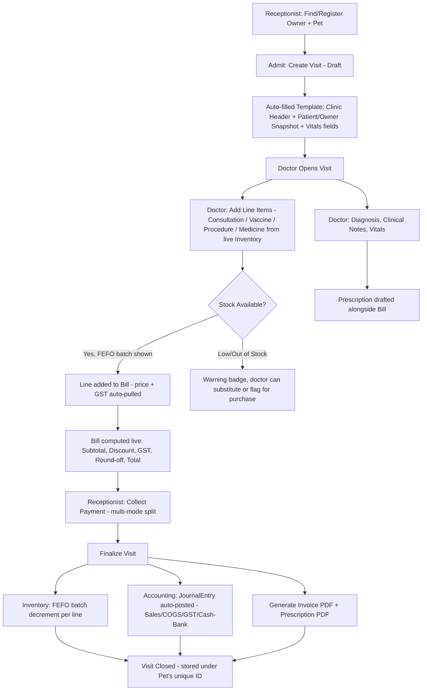

# Harmony ERP Suite — Implementation Plan
## Platform Administration (Super Admin), Unified Owner–Pet CRM, and Visit-to-Invoice Clinical Workflow

> **Document Version**: 1.0
> **Repository**: `harmony-erp-suite`
> **Builds on**: `CURRENT_SYSTEM_ANALYSIS_REPORT.md` (v1.0), `PREVIOUS_ERP_ANALYSIS_AND_BILLING_SPEC.md` (v1.0)
> **Purpose**: Turn the three requested changes — (1) Super Admin / platform administration, (2) multi-pet Owner–Pet CRM with auto-generated IDs, (3) a single connected Admit → Diagnose → Bill → Dispense workflow — into a phased, buildable engineering plan.

---

## 1. Executive Summary

Today, Inventory, Accounting, and the Pet & Owner CRM (seen in the "Register Pet" modal) exist as separate surfaces. There is no concept of platform-level administration, an owner can only be linked to one pet at a time via a flat form, and there is no single workflow that takes a patient from **reception → doctor consultation → prescription → dynamic billing → inventory deduction → accounting entry → printed invoice**.

This plan introduces three connected building blocks:

1. **Platform Administration (Super Admin)** — a role/permission layer sitting above the existing modules, controlling users, clinics/branches, and system configuration.
2. **Owner–Pet CRM Redesign** — one `Owner` record can hold **many** `Pet` records, each with an auto-generated Pet ID, richer clinical/identity fields, and an "Add Another Pet" flow instead of a single flat modal.
3. **Visit Workspace (Consultation → Prescription → Billing)** — a new module that opens the moment a receptionist admits a patient, pre-fills a clinic-branded template, lets the doctor diagnose and pick medicines straight from live inventory, computes the bill dynamically, and on finalization atomically updates Inventory, Accounting (GL/Journal), and generates the Prescription PDF + Invoice/Receipt PDF — all filed under one Patient/Visit ID.

---

## 2. Guiding Principles

- **Don't break what works**: double-entry accounting, FEFO batch dispatch, GST templates, and atomic counters (`counters.ts`) stay as the backbone — the new modules *call into* them, they don't replace them.
- **One source of truth per entity**: a Pet always belongs to exactly one Owner; a Visit always belongs to exactly one Pet; an Invoice and a Prescription always belong to exactly one Visit.
- **Everything server-validated**: all new forms use `createServerFn` + Zod, consistent with the existing RPC layer.
- **Role-gated, not just role-labelled**: every write server function checks permissions, not just the UI hiding buttons.

---

## 3. Part A — Platform Administration (Super Admin)

### 3.1 Role Model

| Role | Scope | Typical Powers |
| :--- | :--- | :--- |
| **Super Admin** | Entire platform / all branches | Create clinics/branches, manage all users & roles, configure global settings (tax templates, numbering formats, clinic letterhead), view all financial data, impersonate/support mode, feature toggles |
| **Clinic Admin** | Single branch | Manage staff of that branch, view branch-level reports, configure branch info (header, GST no.) |
| **Doctor** | Assigned visits | Diagnose, prescribe, select medicines, view patient clinical history, cannot edit accounting entries directly |
| **Receptionist / Front Office** | Admit, bill, CRM | Register owners/pets, admit patients, create visits, collect payment, print invoice/prescription |
| **Pharmacist / Inventory** | Inventory module | Approve GRN, manage batches, confirm dispensing against a finalized prescription |
| **Accountant** | Accounting module | Full GL, journals, reconciliation, reports; read-only on clinical data |

### 3.2 New Data Model

```
├── PlatformUser   -> userId, name, email, phone, passwordHash, roles [], branchIds [], status (Active/Suspended), lastLogin
├── Role           -> roleKey (super_admin, clinic_admin, doctor, receptionist, pharmacist, accountant), permissions []
├── Permission      -> key (e.g. "visit.diagnose", "invoice.finalize", "inventory.adjust", "gl.post"), module, description
├── Branch         -> branchId, name, address, gstin, letterheadAssets, phone, isActive
└── AuditLog       -> actorId, action, entityType, entityId, beforeState, afterState, timestamp
```

- `PlatformUser.roles` is an array (a person can be both Clinic Admin and Doctor).
- Every server function wraps a `requirePermission(ctx, "permission.key")` guard — centralizing checks instead of scattering role-string comparisons.
- **Super Admin console** (`src/components/erp/admin/`):
  - `UserManagement.tsx` — invite/deactivate users, assign roles & branches.
  - `BranchManagement.tsx` — CRUD for `Branch`, used to populate the `branch` dropdown already referenced in the legacy invoice header spec.
  - `SystemSettings.tsx` — numbering formats (Pet ID / Owner ID / Visit ID / Invoice prefixes), default GST templates, feature flags.
  - `AuditTrail.tsx` — searchable log of sensitive actions (journal edits, stock adjustments, user role changes).

### 3.3 Auth/Session Notes
- Extend the existing session/Zod-validated RPC layer with a `currentUser` context object carrying `roles` + `branchId`, resolved once per request and reused by all downstream server functions (no per-call re-fetching).

---

## 4. Part B — Owner–Pet CRM Redesign

### 4.1 Problem with the Current Modal
The current "Register Pet" modal (single flat form) ties one Pet ID directly to one set of owner fields typed inline — so a returning owner with a second pet has to re-type owner details, and there's no shared Owner record to attach visit history, billing history, or outstanding dues across all their pets.

### 4.2 New Model: Owner (parent) → Pets (children, 1‑to‑many)

```
├── Owner   -> ownerId (OWN-0001…), name, phone (unique, indexed), altPhone, email,
│              address, idProofType, idProofNo, preferredPaymentMode,
│              referredBy, createdAt, notes, outstandingBalance (derived)
│
└── Pet     -> petId (PET-0001…), ownerId (ref -> Owner), name, species, breed,
               gender, dob/ageYears, color/markings, weightKg, microchipNo,
               sterilizationStatus, allergies [], chronicConditions [],
               photoUrl, status (Active/Deceased/Transferred), registeredAt
```

- **Auto-generated IDs**: both `ownerId` and `petId` use the existing atomic `counters.ts` pattern (`$max` sync) — e.g. `OWN-0001`, `PET-0001` — no manual entry, no collisions.
- **One owner, many pets**: `Pet.ownerId` is a reference, not duplicated owner fields. Owner is created/looked-up once; every subsequent pet reuses it.

### 4.3 New UI Flow (replaces the single modal)

1. **Step 1 — Find or Create Owner**
   Search by phone/name first (autocomplete). If found → skip to Step 2 with owner pre-filled. If not found → inline "New Owner" mini-form (name, phone, email, address, ID proof).
2. **Step 2 — Register Pet**
   Full detail form (species, breed, DOB/age, gender, weight, microchip, sterilization, known allergies, photo upload) — Pet ID auto-generates on save.
3. **Step 3 — "Add Another Pet?"**
   One-click button that reopens Step 2 with the *same* owner already attached — this is the core fix for multi-pet households.
4. **Owner Profile Page** (new): shows the owner's details plus a table of *all* their pets, each linking to that pet's full visit/prescription/invoice history and any outstanding balance.

### 4.4 Component/File Plan
| Component | File | Notes |
| :--- | :--- | :--- |
| Owner search & create | `src/components/erp/crm/OwnerLookup.tsx` | Autocomplete + inline create |
| Pet registration form | `src/components/erp/crm/PetRegistrationForm.tsx` | Replaces current modal body; used standalone and inside Visit Workspace intake |
| Owner profile / pet list | `src/components/erp/crm/OwnerProfileView.tsx` | New — multi-pet dashboard |
| Server functions | `src/server/crm/owner.ts`, `src/server/crm/pet.ts` | `findOwnerByPhone`, `createOwner`, `createPet`, `listPetsByOwner` |

---

## 5. Part C — Visit Workspace: Admit → Diagnose → Bill → Dispense

This is the core of the request: one connected flow from admission to a finalized, inventory- and accounting-linked invoice + prescription, all filed under a single patient/visit ID.

### 5.1 Flow Diagram



### 5.2 Visit Lifecycle (State Machine)

`Admitted (Draft)` → `In Consultation` → `Diagnosed` → `Billed (Pending Payment)` → `Paid / Partially Paid` → `Closed`

- Only the assigned **Doctor** can move `In Consultation → Diagnosed` (adds/edits diagnosis, Rx, medicine lines).
- Only **Receptionist/Billing** can move `Billed → Paid/Closed` (payment capture, invoice finalize).
- **Pharmacist** confirms physical dispensing against the finalized Rx (optional secondary step, keeps clinical and physical stock actions separate for audit).
- Editing after `Closed` requires a permissioned "Amend Visit" action that creates a linked credit/adjustment note rather than silently overwriting history (keeps GL and stock ledgers honest).

### 5.3 The Template (What the Receptionist Sees on Admit)

Auto-populated, half-filled form the moment "Admit Patient" is clicked:

| Section | Fields | Source |
| :--- | :--- | :--- |
| Clinic Header | Branch name, address, GSTIN, logo | `Branch` (Super Admin config) |
| Patient Snapshot | Pet ID, name, species/breed, age, owner name & phone | `Pet` + `Owner` (read-only, pulled automatically) |
| Visit Meta | Visit ID (auto), Date/time, Branch, Bill Type (GST/Non-GST), Assigned Doctor | Auto + dropdown |
| Vitals (Receptionist-fillable) | Weight, Temp, presenting complaint (free text) | Manual entry, editable later by doctor |
| — Doctor-only section unlocks after this — | Diagnosis, clinical notes, Rx lines, next visit/vaccine/deworming dates | Doctor role only |

### 5.4 Doctor's Consultation Panel

- **Left**: Patient history timeline (past visits, past prescriptions, allergies flagged prominently).
- **Center**: Diagnosis + clinical notes (free text + optional structured tags), and an item picker that searches **live inventory** (reuses `StockView`/`ItemDetailView` data) — typing a medicine name shows available batches, FEFO-recommended batch auto-selected, stock-health badge visible inline.
- **Right (live)**: Running bill — every item added from the picker (medicine, vaccine, consultation fee, procedure, diagnostic test) appears instantly with qty, rate, discount%, GST%, and line total, grouped by category (`Vaccine`, `Consultation & Procedures`, `Pharmacy & Medicines`, `Diagnostic Tests`, `Services & Daycare`) — directly reusing the legacy VetSync categorization.
- Doctor also sets `nextVisitDate`, `nextVaccineDate`, `nextDewormingDate` here — these flow straight onto the printed receipt/prescription per the gap-analysis requirement.

### 5.5 Data Model

```
├── Visit           -> visitId (V-0001…), petId, ownerId, branchId, doctorId, receptionistId,
│                       date, status (Admitted/InConsultation/Diagnosed/Billed/Paid/Closed),
│                       vitals { weightKg, tempC, complaint },
│                       diagnosis, clinicalNotes,
│                       nextVisitDate, nextVaccineDate, nextDewormingDate
│
├── PrescriptionLine -> visitId, lineType (Medicine/Vaccine/Consultation/Procedure/DiagnosticTest/Service),
│                       itemCode (ref InventoryItem, nullable for pure services), batchNo (ref StockBatch),
│                       description, quantity, dosageInstructions (for medicines),
│                       unitPrice, discountPercent, gstRate, lineTotal
│
├── Invoice          -> invoiceNo (INV/FY/XXXX), visitId, petId, ownerId, billType (GST/Non-GST),
│                       subtotal, billDiscount, taxableValue, gstAmount, roundOff, totalAmount,
│                       payments [{ mode, amount, timestamp, refNo }], balanceDue, status
│
└── Prescription     -> prescriptionNo (RX-XXXX), visitId, petId, doctorId, issuedAt, pdfUrl
```

- `Visit`, `Invoice`, and `Prescription` all key off `petId` — so the **Owner Profile / Pet detail page** can show a full timeline of visits, prescriptions, and invoices per pet without extra joins.
- `PrescriptionLine.batchNo` links straight into the existing FEFO `StockBatch` model — no parallel inventory system.

### 5.6 Integration Points With Existing Modules

| On Visit Finalization | Existing Module Touched | Effect |
| :--- | :--- | :--- |
| Each medicine/consumable line | `StockBatch` / `BillingSync.tsx` logic | FEFO decrement, same engine already used for counter sales |
| Bill total & GST split | `TaxTemplate`, `GLAccount` | Auto-creates a `JournalEntry` (Debit: Cash/Bank or Accounts Receivable, Credit: Sales Income + GST Payable), sequence `JV-XXXX` |
| Payment capture | `PaymentEntry` | Same `PE-XXXX` model as Receivables/Payables, `partyType = Owner` |
| Low stock triggered mid-consultation | `StockView` reorder logic | Surfaces a badge to the doctor/pharmacist, does not block care |
| Referral / diagnostic lines (optional, phase 2) | Doctor Referral Commission ledger | If `Reference Doctor` is set on a diagnostic line, feeds commission tracking from the legacy spec |

---

## 6. Part D — Invoice & Prescription Generation

### 6.1 Two Distinct Documents, One Visit

| Document | Trigger | Contents | Numbering |
| :--- | :--- | :--- | :--- |
| **Prescription (Rx)** | Doctor marks Diagnosed | Clinic header, patient/owner info, diagnosis, medicine list with dosage instructions, doctor's name & digital signature block, next visit/vaccine/deworming dates | `RX-XXXX` |
| **Invoice / Receipt** | Payment finalized | Clinic header (with GSTIN if GST bill), patient/owner info, category-grouped line items, GST breakdown (CGST/SGST/IGST as applicable), payment mode(s), balance due, next visit reminder footer | `INV/FY/XXXX` (matches legacy format) |

- Both are stored with a `pdfUrl` against the `Visit`, retrievable from the Pet's history at any time — reprint doesn't regenerate a new number.
- Print layouts support both **A4** (detailed) and **80mm thermal** (compact), matching the legacy `Download PDF` behavior.
- `billType` toggle (GST/Non-GST) controls layout exactly as in the legacy spec.

### 6.2 Reprint / Amend Rule
Amending a closed visit (e.g., wrong medicine dispensed) creates a linked **Credit Note / Adjustment Invoice**, never edits the original PDF in place — preserves GST audit trail and GL integrity.

---

## 7. Phased Delivery Plan

| Phase | Scope | Key Deliverables |
| :--- | :--- | :--- |
| **Phase 1 — Foundations** | RBAC & Super Admin | `PlatformUser`, `Role`, `Permission`, `Branch` models; `requirePermission` guard; Super Admin console (Users, Branches, Settings) |
| **Phase 2 — CRM Redesign** | Owner–Pet remodel | `Owner`/`Pet` schemas + counters; Owner Lookup + Pet Registration flow; Owner Profile page; data migration script for existing pet records into the new Owner/Pet split |
| **Phase 3 — Visit Workspace MVP** | Admit → Diagnose (no billing yet) | `Visit` model + state machine; Admit template; Doctor consultation panel (diagnosis + notes only, no live billing yet) |
| **Phase 4 — Dynamic Billing & Inventory Hook** | Live item picker + FEFO | `PrescriptionLine` model; inventory search/selection UI; live running bill panel; FEFO batch decrement on finalize |
| **Phase 5 — Accounting Integration** | Auto-journaling | Auto `JournalEntry` + `PaymentEntry` creation on invoice finalize; GST template reuse; Receivables aging hook for unpaid balances |
| **Phase 6 — Document Generation** | PDFs | Prescription PDF template; Invoice/Receipt PDF (A4 + thermal); reprint history; next-visit/vaccine/deworming footer |
| **Phase 7 — Hardening & UAT** | Testing, migration, training | End-to-end visit walkthroughs, role-permission test matrix, staff training, rollback plan for Phase 2 migration |

**Suggested sequencing rationale**: RBAC first (everything downstream needs permission checks), CRM second (Visit Workspace needs Owner/Pet as inputs), then the Visit flow built incrementally (clinical → billing → accounting → documents) so each phase is independently testable before the next depends on it.

---

## 8. Server Functions to Build (Representative List)

```
auth/permissions.ts     -> requirePermission(ctx, key)
crm/owner.ts             -> findOwnerByPhone, createOwner, updateOwner, listOwnerPets
crm/pet.ts                -> createPet, updatePet, getPetHistory
visits/visit.ts           -> admitPatient, updateVitals, saveDiagnosis, addLineItem,
                              removeLineItem, computeBillPreview, finalizeVisit, amendVisit
visits/prescription.ts    -> generatePrescriptionPdf
billing/invoice.ts        -> generateInvoicePdf, recordPayment
inventory/dispense.ts     -> decrementFefoBatch (reused from BillingSync engine)
accounting/autopost.ts    -> postSalesJournal(visitId), postPaymentEntry(visitId)
admin/users.ts             -> inviteUser, assignRole, deactivateUser
admin/branches.ts          -> createBranch, updateBranch
```

---

## 9. Risks & Mitigations

| Risk | Mitigation |
| :--- | :--- |
| Migrating existing flat pet records into Owner/Pet split could orphan/duplicate owners | Write a one-time migration script that dedupes owners by phone number before splitting; run on staging with a full backup and manual spot-check before production cutover |
| Doctor adding medicines that are out of stock mid-consultation | Non-blocking warning + "flag for reorder" instead of a hard stop, so patient care is never blocked by stock UI |
| Concurrent edits to the same Visit (doctor + receptionist simultaneously) | Reuse existing optimistic concurrency pattern from `ErpRow`; lock diagnosis fields to doctor-role only, billing fields to receptionist-role only, so conflicting concurrent writes are structurally rare |
| GST/accounting entries posted incorrectly on visit amendment | Enforce credit-note-only amendments post-close (never in-place edits) so GL stays auditable |
| Permission sprawl (too many granular permission keys) | Start with module-level permissions (`visit.*`, `inventory.*`, `gl.*`) and only split into finer-grained keys where a real business need appears |

---

## 10. Acceptance Criteria (Definition of Done)

- [ ] A Super Admin can create a branch, invite a Clinic Admin/Doctor/Receptionist, and see the permission take effect immediately without a re-login.
- [ ] An owner with two pets can register both under one Owner ID, each pet getting its own auto-generated Pet ID, without re-entering owner details the second time.
- [ ] Admitting a patient creates a Visit pre-filled with clinic header + patient/owner snapshot in under the time it takes to type nothing (fully automatic).
- [ ] A doctor can add a diagnosis, select 3+ medicines from live inventory (with FEFO batch shown), and see the bill total update live without a page reload.
- [ ] Finalizing the visit in one action: decrements the correct FEFO batches, posts a balanced JournalEntry, records the PaymentEntry, and produces both a Prescription PDF and an Invoice PDF — all retrievable later from the pet's history.
- [ ] Trial balance remains balanced (Debits = Credits) after any number of finalized visits, verifiable in `ChartOfAccounts.tsx`.
- [ ] Amending a closed visit produces a credit note, never mutates the original invoice/prescription PDF.

---

*This plan is the engineering blueprint for the Super Admin layer, the multi-pet Owner–Pet CRM, and the connected Admit → Diagnose → Bill → Dispense workflow requested for Harmony ERP Suite.*
