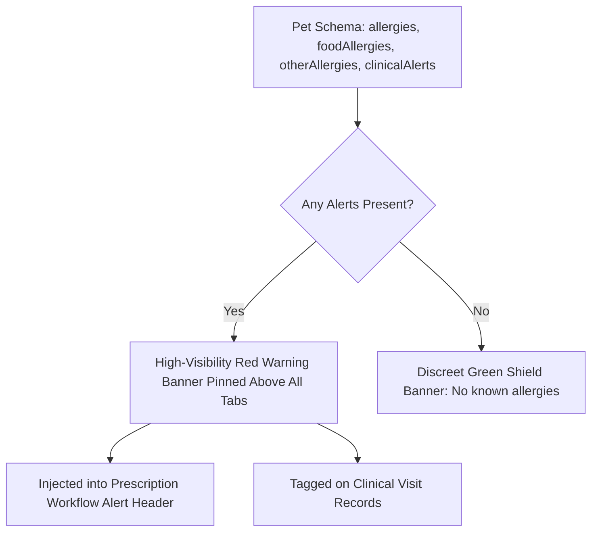

# Detailed Veterinary Patient 360° Profile — In-Depth Specification & Input Study

> **Document Version**: 2.0  
> **Target System**: Harmony ERP Suite (Veterinary Hospital Management & EMR)  
> **Source Directive**: `new_patient_profile.md`  
> **Scope**: Complete Architectural Audit, Database Schema Mapping, Form Input Specifications, UI/UX Wireframes, and Cross-Module Integration Plan for the Veterinary Patient 360° Profile.

---

## 1. Executive Summary & Architectural Overview

The current veterinary ERP system features two representations of patient information:
1. **Compact Dashboard Dossier** (`DashboardPatientActivityPanel.tsx`): A compact, single-card popup (`max-w-md`) that acts only as a brief snapshot of basic vitals and patient name.
2. **Patient 360° Profile Dialog** (`Patient360Profile.tsx`): An existing modular profile component currently housed within the CRM Hub (`PetOwnerCrmHub.tsx`).

### Core Transformation Goal
Transform the Patient Profile from a fragmented/compact summary into a **unified, medical-grade Veterinary Patient 360° EMR Profile** accessible across all clinical and administrative touchpoints (**Reception Front Desk**, **Appointments Hub**, **Doctor OPD Queue**, and **CRM Hub**).

```mermaid
graph TD
    A[Reception Lobby / OPD Waiting Queue] -->|Click Patient / UID| P[Patient 360° Profile]
    B[Appointments & Queue Hub] -->|Click Pet Name / UID| P
    C[Doctor OPD Consultation Desk] -->|Click Patient Details| P
    D[Pet & Owner CRM Hub] -->|Row Click / Detail Action| P

    subgraph "Patient 360° Profile (Unified Master Record)"
        P --> H[1. Patient & Owner Header Card]
        P --> AL[2. Pinned Allergy & Clinical Alerts Banner]
        P --> T1[Tab 1: Overview - 360° Summary]
        P --> T2[Tab 2: Appointments - Past & Upcoming]
        P --> T3[Tab 3: Medical History - Visit Timeline]
        P --> T4[Tab 4: Consultations & Reports]
        P --> T5[Tab 5: Prescriptions & Active Rx]
        P --> T6[Tab 6: Preventive Care - Vaccines & Deworming]
        P --> T7[Tab 7: Documents & Clinical Photo Gallery]
        P --> T8[Tab 8: Billing, Invoices & Payment Ledger]
    end

    P -->|Quick Action| QA1[Start OPD Consultation & Rx]
    P -->|Quick Action| QA2[Book / Reschedule Appointment]
    P -->|Quick Action| QA3[Edit Patient / Edit Owner Modal]
    P -->|Quick Action| QA4[Upload Document / Photo]
```



### Unbroken Clinical Workflow Preservation
The implementation strictly adheres to the existing veterinary hospital pipeline:
$$\text{Reception} \longrightarrow \text{Patient Profile} \longrightarrow \text{Prescription} \longrightarrow \text{Medical Records} \longrightarrow \text{Reports} \longrightarrow \text{History} \longrightarrow \text{Appointments} \longrightarrow \text{Billing}$$

No existing MongoDB collections (`Pet`, `Owner`, `ClinicalVisit`, `SalesDoc`, `Vaccination`, `DewormingRecord`) are destroyed or rebuilt from scratch. All enhancements extend the existing schemas backward-compatibly.

---

## 2. In-Depth Study of Required Inputs & UI Schema

### Section 1: Patient Profile Header Card

The header card serves as the persistent anchor at the top of the profile modal. It must present immediate patient identification, life status, and direct clinical quick actions.

| Field / Element | Data Source & Path | UI Component | Format / Behavior | Validation Rules |
| :--- | :--- | :--- | :--- | :--- |
| **Patient Photo** | `pet.photoUrl` | Rounded-2xl avatar (80×80px) with fallback icon | Dynamic image thumbnail; camera/upload hover overlay | Fallback to species emoji (🐶/🐱/🦜/🐰) if null |
| **Patient Name** | `pet.name` | `DialogTitle` (text-xl font-bold) | Capitalized string, e.g. "Bruno" | Required, min 2 chars |
| **Patient UID** | `pet.petId` | Font-mono badge | Non-editable identifier (e.g. `PET-0001`) | Unique indexed string |
| **Species** | `pet.species` | Text badge | `Canine`, `Feline`, `Avian`, `Rabbit`, `Exotic`, `Other` | Required enum |
| **Breed** | `pet.breed` | Text span | E.g. "German Shepherd", "Persian Cat" | Required string |
| **Gender / Sex** | `pet.gender` | Text span + symbol (♂/♀) | `Male`, `Female`, `Neutered Male`, `Spayed Female` | Required enum |
| **Current Age** | Computed via `ageLabel(pet)` | Text span | E.g. "4 Years", "6 Months", "2 Years 3 Mo" | Derived from DOB or `ageYears`/`ageMonths` |
| **Date of Birth** | `pet.dob` | Text span | E.g. `12/04/2022` (DD/MM/YYYY) | Optional, cannot be future date |
| **Current Weight** | `pet.weightKg` or latest visit vitals | Bold metric badge | E.g. `18.5 kg` (synced with latest OPD triage) | Numeric > 0, up to 1 decimal place |
| **Current Status** | `pet.status` | `StatusPill` badge | `Active` (green), `Under treatment` (blue), `Vaccination due` (amber), `Deceased` (gray) | Enum default: `Active` |
| **Sterilization Status** | `pet.sterilizationStatus` | Secondary badge | `Intact`, `Sterilized`, `Unknown` | Enum |
| **Microchip Number** | `pet.microchipNo` | Font-mono badge | ISO 15-digit microchip code or alphanumeric | Optional, max 30 chars |
| **Blood Group** | `pet.bloodGroup` | Outline badge | E.g. `DEA 1.1+`, `DEA 1.1-`, `A`, `B`, `AB` | Optional string |
| **Coat / Color** | `pet.color` | Text span | E.g. "Black & Tan", "Golden Cream" | Optional string |

#### Quick Actions Toolbar (Header)
1. **Start OPD Consultation & Rx →** (Primary button with `Stethoscope` icon): Immediately invokes `onStartConsultation(pet, owner)` with pre-populated patient demographics, vitals, and allergies.
2. **Book Appointment** (`CalendarPlus` icon): Opens `BookAppointmentModal` with `petId`, `ownerId`, `petName`, and `ownerPhone` locked and pre-selected.
3. **Edit Patient** (`Edit2` icon): Opens `EditPetDialog` with live validation.
4. **Edit Owner** (`User` icon): Opens `EditOwnerDialog` with multiline address and contact validation.
5. **Upload Photo** (`Camera` icon): Triggers direct device file picker or camera capture.
6. **Upload Document** (`Upload` icon): Opens modal to attach lab reports, X-rays, or certificates.
7. **View Medical Records** (`ClipboardList` icon): Switches tab directly to `medical`.
8. **View Reports** (`FileText` icon): Switches tab directly to `consultations`.
9. **View Previous Bills** (`Receipt` icon): Switches tab directly to `billing`.

---

### Section 2: Patient Photo Management

The photo subsystem separates the **Patient Profile Photo** from the **Clinical Photo Gallery** to prevent clinical wound or surgical pictures from overwriting the pet's primary avatar.

```mermaid
graph LR
    U[Upload Input: Device / Files / Camera] --> R[Client-Side Resize: Max 360px JPEG]
    R --> D[Base64 Data URL (~50-150 KB)]
    D --> P{User Action}
    P -->|Set as Profile Photo| DB1[Update Pet.photoUrl in MongoDB]
    P -->|Save to Gallery| DB2[Save to ErpRow patient_files with category & tags]
```

#### Detailed Photo Upload Options & Validations
* **Device / Gallery Picker**: Triggers standard `image/*` file selector.
* **Files Selector**: Restricted to `.jpg, .jpeg, .png, .webp`.
* **Live Camera Capture**: Uses HTML5 input attribute `capture="environment"` (supported on mobile, tablet, and webcam laptops).
* **Automatic Client-Side Downscaling**: `resizeImage(src, 360, 0.85)` utilizes an HTML5 canvas to compress and constrain dimensions to 360×360px maximum, keeping the base64 string lightweight (< 200 KB) and saving serverless payload overhead.
* **Preview Dialog**: User can preview the resized image before committing it.
* **Explicit Action**: The user must explicitly click "Set as Profile Photo" or "Save to Clinical Gallery".
* **Remove Photo**: Reverts `Pet.photoUrl` to empty string and restores the SVG default animal avatar.

---

### Section 3: Patient Information Matrix

Displayed in a responsive 3-column or 4-column definition grid (`<dl>`) in the **Overview** tab:

```
+--------------------------------------------------------------------------------------------------+
| 🐾 PATIENT INFORMATION                                                                           |
+----------------------------------+----------------------------------+----------------------------+
| Patient Name: Bruno              | Patient ID: PET-0001 (Mono)      | Species: Canine            |
| Breed: German Shepherd           | Gender: Male                     | Date of Birth: 12/04/2022  |
| Age: 4 Years                     | Current Weight: 18.5 kg          | Coat / Color: Black & Tan  |
| Sterilization: Intact            | Microchip No: 985141002341258    | Blood Group: DEA 1.1+      |
| Identification Tag: TAG-8821     | Status: ● Active                 | Diet Preference: Royal C.  |
+----------------------------------+----------------------------------+----------------------------+
```

---

### Section 4: Pet Parent / Owner Information

This section connects the pet to their legal guardian and household. It supports multiline billing addresses and family pet linkages.

#### Required Fields & Validations
1. **Full Name \***: String, min 2 chars.
2. **Owner ID / Client ID**: Non-editable unique font-mono code (e.g. `OWN-0001`).
3. **Primary Contact Phone \***: 10-digit Indian phone number (`+91` prefix, stripped of non-digits, validated against `/^[6-9]\d{9}$/`).
4. **Alternate Contact Phone**: Optional 10-digit emergency contact phone number.
5. **Email Address**: Optional, validated against standard email RFC regex. Used for digital PDF prescription and invoice dispatch.
6. **Billing Address \***: Multiline textarea support (street, apartment, landmark).
7. **City**: E.g. "Nagpur", "Pune", "Mumbai".
8. **State \***: E.g. "Maharashtra" (GST State code: 27).
9. **PIN Code**: 6-digit Indian Postal PIN code (`/^\d{6}$/`).
10. **Country**: Default: "India".
11. **Occupation**: Optional client profession (e.g. "Advocate", "Software Engineer").
12. **Relationship with Pet**: Dropdown: `Owner`, `Co-owner`, `Family Member`, `Caretaker`, `Foster`, `Other`.

#### Multi-Pet Family Linkage ("Other Pets by This Owner")
* Automatically queries MongoDB for all pets where `ownerId === pet.ownerId && petId !== currentPet.petId`.
* Renders a quick clickable mini-card for every sibling pet:
  `[🐾 Bella · Feline · Persian · Active]` `[🐾 Simba · Canine · Golden Retriever · Active]`
* Clicking any sibling pet immediately loads that pet into the Patient 360° Profile without exiting the screen.

---

### Section 5: Direct Communication & Contact Actions

To minimize latency for receptionists and doctors, the profile provides instant communication triggers:

```
+--------------------------------------------------------------------------------------------------+
| 📞 CONTACT & REACHABILITY                                                                         |
| Primary: +91 98230 44556 [📞 Call] [💬 WhatsApp] | Alt: +91 94221 00223 [📞 Call]                |
| Email: parent@gmail.com [✉ Send Email]                                                            |
| Complete Address: Flat 402, Royal Palms, Civil Lines, Nagpur, Maharashtra - 440001, India         |
+--------------------------------------------------------------------------------------------------+
```

* **Click-to-Call**: `<a href="tel:+919823044556">` triggers device dialer.
* **Instant WhatsApp**: Opens `https://wa.me/919823044556?text=Hello%20Rajesh,%20regarding%20Bruno...` reusing standard Indian international dialing prefix.
* **Email Dispatch**: `<a href="mailto:parent@gmail.com?subject=Regarding Bruno (PET-0001)">`.

---

### Section 6: Drug Allergies & Clinical Alerts

Medical safety is paramount. Allergies and clinical warnings must **never** be scrolled off-screen or hidden inside an obscure tab.



#### Alert Categories
1. **Drug Allergies**: High-risk medications (e.g., `NSAIDs (Meloxicam)`, `Penicillin G`, `Sulfa Drugs`, `Ivermectin`).
2. **Food Allergies**: E.g., `Chicken Protein`, `Dairy`, `Gluten`.
3. **Other Allergies**: E.g., `Flea Saliva / FAD`, `Pollen / Atopic Dermatitis`.
4. **Important Clinical Alerts**: E.g., `Cardiac Murmur Grade 3`, `Epileptic - History of Seizures`, `Aggressive during examination / Requires Muzzle`.

---

### Section 7: Current Clinical Summary

Consolidates the latest objective clinical indicators extracted from recent `ClinicalVisit` records and MongoDB vitals:

| Parameter | Data Path | Display Value (Example) | Fallback if Missing |
| :--- | :--- | :--- | :--- |
| **Current Weight** | `vitals.weightKg` or `pet.weightKg` | `18.5 kg` | `N/A` |
| **Body Temperature** | `vitals.tempC` | `38.6 °C` (Normal: 38–39.2°C) | `N/A` |
| **Heart / Pulse Rate** | `vitals.pulseRate` | `98 bpm` | `N/A` |
| **Respiratory Rate** | `vitals.respRate` | `24 breaths/min` | `N/A` |
| **SpO2 Oxygen Sat.** | `vitals.spo2` | `98%` | `N/A` |
| **Active Medications** | Active prescriptions (unexpired) | E.g. "Amoxicillin 250mg, Meloxicam 0.5ml" | `None active` |
| **Chronic Conditions** | `pet.chronicConditions` | E.g. "Atopic Dermatitis, Hip Dysplasia" | `None recorded` |
| **Recent Diagnosis** | `latestVisit.diagnosis` | E.g. "Acute Gastroenteritis" | `N/A` |
| **Last Consultation** | `pet.lastVisitDate` or `latestVisit.date` | `12 Sep 2026` | `No previous visits` |
| **Next Follow-up Due**| `latestVisit.nextVisitDate` | `19 Sep 2026` | `None scheduled` |
| **Next Vaccine Due** | `pet.nextVaccineDate` / `Vaccination` | `14 Oct 2026 (Annual DHPPiL Booster)` | `Up to date` |
| **Next Deworming Due**| `pet.nextDewormingDate` / `Deworming`| `20 Nov 2026 (Praziquantel/Pyrantel)` | `Up to date` |

> [!IMPORTANT]
> No simulated or fake data is ever rendered. If a parameter was not recorded during examination, it outputs `N/A` cleanly.

---

### Section 8: Medical History (Visit Timeline)

The **Medical History** tab formats historical outpatient visits, emergency triages, and follow-ups as a chronological timeline:

#### Record Attributes per Timeline Node
* **Date & Time**: Formatted display date (e.g. `12 Sep 2026, 11:30 AM`).
* **Visit ID / Token**: E.g. `VIS-2026-0045` (linked to full record).
* **Attending Veterinarian**: E.g. `Dr. Rohit Sharma (Consultant Vet)`.
* **Chief Complaint**: E.g. `Persistent vomiting, mild fever for 2 days`.
* **Diagnosis**: E.g. `Dietary Indiscretion / Mild Enteritis`.
* **Clinical Findings**: E.g. `Abdomen slightly tense on palpation, mucous membranes pink, hydration adequate`.
* **Treatment Notes**: E.g. `Fluid therapy administered, antiemetic injection given`.
* **Follow-up Interval**: E.g. `Review in 3 days if symptoms persist`.
* **Action**: Clicking any timeline item opens `VisitWorkspaceModal` to view or print the full consultation record.

---

### Section 9: Previous Appointment History

Tabular or card-based historical register of past appointments:

```
+--------------------------------------------------------------------------------------------------------------------+
| Date       | Time     | Doctor           | Type         | Reason / Chief Complaint    | Status     | Action        |
+------------+----------+------------------+--------------+-----------------------------+------------+---------------+
| 12/09/2026 | 11:30 AM | Dr. Rohit Sharma | Consultation | Fever and vomiting          | Completed  | [View Record] |
| 15/08/2026 | 10:00 AM | Dr. Manisha M.   | Vaccination  | Annual Rabies + DHPPiL      | Completed  | [View Record] |
| 02/06/2026 | 04:30 PM | Dr. Rohit Sharma | Follow-up    | Ear hematoma post-op check  | No Show    | [Details]     |
+--------------------------------------------------------------------------------------------------------------------+
```

---

### Section 10: Upcoming Appointments

Highlights future bookings to prevent double-booking and ensure timely reminders:

* **Columns / Card Fields**:
  * Date & Time (e.g. `28 Sep 2026, 10:30 AM`)
  * Queue Token (e.g. `A-134`)
  * Assigned Doctor
  * Category / Channel (Walk-in, WhatsApp, Call)
  * Visit Type & Reason
  * Status: `Scheduled`, `Confirmed`, `Waiting in Queue`
* **Direct Actions**:
  * **View Details**: Inspect appointment payload.
  * **Reschedule**: Reopens appointment editor with pre-filled details.
  * **Cancel**: Invokes `updateAppointmentStatusFn` with confirmation prompt.
* **+ Schedule Appointment Button**: Automatically locks the current patient and owner into `BookAppointmentModal`.

---

### Section 11: Previous Consultation Reports

Provides complete clinical consultation summaries with immediate print and PDF export:

* **Report Header**: Hospital Letterhead, Patient Demographics, Owner Info, Date, Doctor.
* **Clinical Body**: Chief Complaint, Vitals (Weight, Temp, HR, RR), Symptoms, Diagnosis, Clinical Findings.
* **Prescription Table**:
  * Orally Prescribed Medicines (Drug name, dosage, frequency, duration, route, instructions).
  * In-Clinic Injections Administered (Medicine, dose, route, timestamp).
  * Animal Nutrition / Dietary Plan (Food item, quantity, frequency, instructions).
  * Pathology / Laboratory Investigations Ordered (CBC, Serum Biochemistry, USG, X-Ray).
* **Billing & Fee Summary**: Total consultation fee, medication charges, procedure charges, paid status.
* **Export Actions**:
  * **View Report**: Opens modal preview.
  * **Print**: Direct browser print styling (`PrescriptionPrintView`).
  * **Download PDF**: Client-side / server-side formatted PDF download.

---

### Section 12: Prescription & Medication History

An aggregated register of every medication ever prescribed or administered to this patient across all visits:

```
+--------------------------------------------------------------------------------------------------------------------+
| Date       | Medicine & Strength | Dosage / Quantity | Frequency | Duration | Route | Prescribed By | Status       |
+------------+---------------------+-------------------+-----------+----------+-------+---------------+--------------+
| 12/09/2026 | Amoxicillin 250mg   | 1 Tab             | Twice/day | 5 Days   | Oral  | Dr. Rohit S.  | ● Active     |
| 12/09/2026 | Pantoprazole 20mg   | 1/2 Tab           | Once/day  | 5 Days   | Oral  | Dr. Rohit S.  | ● Active     |
| 15/08/2026 | Cefotaxime 500mg Inj| 2.5 ml            | Once stat | Stat     | IV    | Dr. Manisha M.| ✓ Completed  |
+--------------------------------------------------------------------------------------------------------------------+
```

* **Status Tracking**: Automatically marks medicines as `Active` if current date falls within `dateOfVisit + durationDays`, otherwise `Completed`.

---

### Section 13: Vaccination & Deworming (Preventive Care)

A two-part preventive medicine hub essential for companion animal wellness:

#### Sub-Section A: Vaccination History
* **Vaccine Name**: E.g., `DHPPiL (9-in-1)`, `Anti-Rabies (ARV)`, `Kennel Cough (Bb/PI)`, `Feline Tricat (FVRCP)`.
* **Date Given**: Date administered (DD/MM/YYYY).
* **Next Due Date**: Automatically highlighted with warning pill if overdue or due in < 14 days.
* **Batch / Lot Number**: Mandatory for cold-chain audit (e.g. `LOT-AB2026-X`).
* **Administering Doctor**: Doctor name & registration number.
* **Clinical Notes**: E.g. "Administered SC right shoulder; no adverse reactions observed".

#### Sub-Section B: Deworming History
* **Date Given**: Date administered.
* **Medicine Name**: E.g., `Drontal Plus (Praziquantel + Pyrantel + Febantel)`.
* **Dosage**: E.g., `1.5 Tablets (based on 15 kg body weight)`.
* **Next Due Date**: Usually 3 months post-administration.
* **Doctor / Paravet**: Administered by staff.
* **Notes**: E.g. "Routine prophylaxis; stool negative for ova".

---

### Section 14: Patient Documents Management

Dedicated document storage linked exclusively to `pet.petId`:

* **Supported File Types**: `.pdf, .jpg, .jpeg, .png, .doc, .docx` (max 3 MB per file).
* **Document Categories**:
  1. `Previous Medical Report`
  2. `Lab Report` (CBC, LFT, KFT, Urinalysis)
  3. `X-Ray / Radiograph`
  4. `Ultrasound (USG) Report`
  5. `Vaccination Certificate`
  6. `Pet Insurance Document`
  7. `Other Medical Document`
* **Storage Engine**: `ErpRow` with `moduleId = "patient_files"`.
* **Security & Associations**: Every upload requires `petId` validation; files are never stored unassociated.
* **Actions**: Preview (inline browser tab), Download to disk, Delete with audit confirmation.

---

### Section 15: Patient Photos & Clinical Photo Gallery

Medical imaging gallery for tracking treatment progression over time:

* **Categories**:
  * `General Patient Photo`
  * `Skin Condition / Lesion`
  * `Wound / Laceration`
  * `Pre-treatment State`
  * `Post-treatment Healing`
  * `Swelling / Edema`
  * `Orthopedic Injury`
  * `Other Clinical Observation`
* **Metadata per Image**: Photo thumbnail, Date captured, Description/Remarks, Uploaded by (Staff ID).
* **"Set as Profile Photo"**: Allows promoting any gallery photo to the main pet avatar without re-uploading.

---

### Section 16 & 17: Billing Summary & Historical Invoices

Veterinary billing requires separating **Current Financial Health** from the **Historical Invoicing Register**.

#### Section 16: Billing Summary Metrics
* **Total Consultation Fees**: Cumulative OPD consultation revenue for this patient.
* **Total Bill Amount**: Cumulative billed value across all pharmacy, diagnostics, procedures, and visits.
* **Total Discount Granted**: Cumulative concessions offered to this client.
* **Total Paid Amount**: Cleared cash, card, and UPI collections.
* **Total Outstanding / Pending Amount**: Current unpaid balance.
* **Last Payment Date**: Timestamp of most recent payment receipt.
* **Overall Status**: `Paid` (Green), `Partially Paid` (Amber), `Pending` (Red).

#### Section 17: Previous Bills & Billing History (Historical Table)
Every generated bill/invoice for this pet is listed in a detailed ledger:

```
+--------------------------------------------------------------------------------------------------------------------+
| Invoice #       | Date       | Doctor     | Total Gross | Discount | Net Billed | Paid    | Pending | Status  | Action |
+-----------------+------------+------------+-------------+----------+------------+---------+---------+---------+--------+
| INV-2026-00125  | 12/09/2026 | Dr. Rohit  | ₹2,500.00   | ₹200.00  | ₹2,300.00  | ₹1,500  | ₹800.00 | Partial | [View] |
| INV-2026-00084  | 15/08/2026 | Dr. Manisha| ₹1,200.00   | ₹0.00    | ₹1,200.00  | ₹1,200  | ₹0.00   | Paid    | [View] |
+--------------------------------------------------------------------------------------------------------------------+
```

* **Bill Actions**:
  * **View Bill / Invoice**: Opens `InvoiceDetailModal` with complete line-item breakdown.
  * **Download PDF / Print**: Direct formatted invoice printing via `InvoicePrintView`.
  * **Settle Balance**: Direct shortcut to record incoming payment for outstanding bills.

---

### Section 18: Payment History Ledger

Detailed receipt register recording every monetary transaction:

* **Payment Date & Timestamp**: Date and exact receipt time.
* **Invoice Reference**: Invoice number credited.
* **Amount Paid**: Currency formatted (`₹1,500.00`).
* **Payment Mode**: `Cash`, `UPI` (GPay/PhonePe), `Card` (POS Terminal), `NetBanking`, `Cheque`.
* **Transaction / Reference Number**: UPI UTR or Card Auth Code (e.g. `UPI/425510294812`).
* **Cashier / Received By**: Front desk staff member username.
* **Receipt Status**: `Cleared`, `Reconciled`.

---

## 3. Recommended Tab-Based Navigation Layout

To prevent vertical clutter and information overload, the Patient 360° Profile organizes its sections across **8 clean, responsive tabs**:

```
+--------------------------------------------------------------------------------------------------+
| [PET PHOTO]  Bruno · PET-0001                                                ● Active Patient     |
|              Canine · German Shepherd · Male · 4 Yrs · 18.5 kg · Rajesh Kulkarni (+91 98230...)   |
| [Start OPD Rx →] [Book Appt] [Edit Patient] [Edit Owner] [Upload Photo] [Upload Doc] [...]        |
+--------------------------------------------------------------------------------------------------+
| ⚠ DRUG ALLERGIES: NSAIDs (Meloxicam), Penicillin G  |  CLINICAL ALERT: Requires Muzzle           |
+--------------------------------------------------------------------------------------------------+
| [ Overview ] [ Appointments ] [ Medical History ] [ Consultations & Reports ]                    |
| [ Prescriptions ] [ Preventive Care ] [ Documents & Photos ] [ Billing & Ledger ]                 |
+--------------------------------------------------------------------------------------------------+
```

### Tab Distribution Matrix

| Tab Key | Tab Label | Included Sections | Primary User Persona |
| :--- | :--- | :--- | :--- |
| `overview` | **Overview** | Patient Info, Owner Info, Family Pets, Quick Contact Actions, Clinical Summary, Next Follow-up Card | Receptionist & Attending Clinician |
| `appointments` | **Appointments** | Upcoming Appointments (with Reschedule/Cancel), Previous Appointment History, + Book Appointment | Front Desk Receptionist |
| `medical` | **Medical History** | Chronological OPD clinical visit timeline, complaints, findings, treatments | Veterinarian / Surgeon |
| `consultations`| **Consultations & Reports** | Full Consultation summary reports, diagnostics, injectables, Print / PDF export | Veterinarian & Client |
| `prescriptions`| **Prescriptions** | Complete prescription drug log, dosage, frequency, duration, route, active/completed status | Pharmacy & Clinician |
| `preventive` | **Preventive Care** | Vaccination log (with batch & due dates), Deworming schedule & alerts | Vaccination In-Charge / Nurse |
| `documents` | **Documents & Photos** | Uploaded medical documents (X-ray, USG, blood reports) + Clinical photo gallery | Diagnostic Tech & Clinician |
| `billing` | **Billing & Ledger** | Current financial health metrics, Historical invoice ledger, Payment transaction audit trail | Cashier / Billing Desk |

---

## 4. Database Schema Mapping & Extension Audit

All fields map directly into the existing MongoDB schemas. Below is the technical field verification:

### 1. `Pet` Model (`src/lib/mongodb/models/Pet.ts`)
* `petId`: Indexed unique string.
* `ownerId`: Indexed owner reference.
* `name`, `species`, `breed`, `gender`: Core biological demographics.
* `dob`, `ageYears`, `ageMonths`: Age calculation anchors.
* `weightKg`: Numeric weight (preliminary or examination).
* `color`, `sterilizationStatus`, `microchipNo`, `bloodGroup`, `tagNumber`: Physical and medical tags.
* `allergies`, `foodAllergies`, `otherAllergies`, `clinicalAlerts`: Medical safety arrays.
* `chronicConditions`, `dietPreference`, `medicalNotes`: Long-term management.
* `photoUrl`: Primary profile photo data URL.
* `status`: Patient lifecycle state (`Active`, `Vaccination due`, `Under treatment`, `Deceased`, `Inactive`).
* `lastVisitDate`, `nextVaccineDate`, `nextDewormingDate`: Denormalized speed-read cache.

### 2. `Owner` Model (`src/lib/mongodb/models/Owner.ts`)
* `ownerId`: Indexed unique string.
* `name`, `phone`, `altPhone`, `email`: Contact endpoints.
* `billingAddress`, `address`, `city`, `state`, `country`, `pin`: Full multiline postal and billing address.
* `relationship`: Guardian relationship (`Owner`, `Caretaker`, etc.).
* `occupation`: Client profession.
* `partyId`: Unified link to financial accounting party ledger.
* `outstandingBalance`: Denormalized receivables ledger balance.

### 3. `ClinicalVisit` Model (`src/lib/mongodb/models/ClinicalVisit.ts`)
* `visitId`, `appointmentToken`: Consultation identifiers.
* `petId`, `ownerId`: Relational anchors.
* `date`, `doctorName`: Operational records.
* `vitals`: `{ tempC, weightKg, pulseRate, respRate, spo2, bloodPressure }`.
* `complaint`, `diagnosis`, `symptoms`, `treatmentNotes`, `followUpNotes`, `nextVisitDate`.
* `items`: Billed procedures and medicines (`IPrescriptionLine[]`).
* `prescriptionData`: Full electronic prescription payload (`immediateMedicines`, `prescribedMedicines`, `injectables`, `animalFoodItems`, `pathologyTests`).
* `payments`: Payment receipts (`IPaymentRecord[]`: `amount`, `mode`, `trxRef`, `timestamp`, `recordedBy`).
* `subtotal`, `discountAmount`, `totalAmount`, `amountPaid`, `balanceDue`, `invoiceNo`.

### 4. `Vaccination` & `DewormingRecord` Models
* `patientId`: Foreign key to `Pet.petId`.
* `vaccineType`, `dateGiven`, `nextDueDate`, `createdBy`.
* Extended for batch tracking: `batchNo?: string`, `notes?: string`.

### 5. `patient_files` (`ErpRow` Module)
* `moduleId = "patient_files"`.
* Data payload: `{ fileId, petId, kind: "document"|"photo", category, name, mime, size, date, description, dataUrl, thumbUrl, uploadedBy }`.

---

## 5. Cross-System Workflow Integration

To make the Patient 360° Profile truly universal across the ERP, it must be integrated into all primary screens:

### 1. Receptionist Dashboard (`ReceptionistDashboardView.tsx`)
* **Current State**: Clicking a patient card in the live lobby opens `View Ticket`.
* **Enhanced State**: 
  * Clicking the patient name, pet avatar, or `PET-xxxx` badge opens `Patient360Profile`.
  * The receptionist can review historical bills, outstanding balances, and vaccination due dates right before admitting the client.

### 2. Appointments & OPD Queue Hub (`AppointmentsQueueHub.tsx`)
* **Current State**: Table lists appointments with non-clickable pet name.
* **Enhanced State**:
  * Pet name and Patient ID badges render as interactive links (`cursor-pointer hover:underline text-primary`).
  * Clicking instantly opens `Patient360Profile` for that patient.

### 3. Doctor Consultation & OPD Desk (`DoctorDashboardView.tsx`)
* **Current State**: Right panel has a compact `max-w-md` dossier modal.
* **Enhanced State**:
  * The compact modal's "Full Profile" action launches the complete `Patient360Profile`, allowing the doctor to review X-rays, USG reports, and long-term medication history during consultation.

### 4. Direct Consultation Launch from Profile
* When the doctor or receptionist clicks **Start OPD Consultation & Rx →** inside `Patient360Profile`:
  1. The profile invokes `onStartConsultation(pet, owner)`.
  2. The ERP launches `PrescriptionWorkflow.tsx` or `VisitWorkspaceModal.tsx`.
  3. Patient demographics, owner name, phone, allergies, and preliminary weight are automatically populated without manual re-typing.
  4. Upon saving consultation, returning to the profile reflects the new visit, prescription lines, and generated invoice.

---

## 6. Implementation Verification Checklist

- [x] **Header Card**: Displays photo, pet demographics, owner contact, life status, and quick action buttons.
- [x] **Photo Management**: Supports camera capture, device upload, compression, preview, and separate clinical gallery.
- [x] **Demographic & Contact Matrix**: Full 3-column patient data, multiline address, and 10-digit Indian phone validation.
- [x] **Sibling Family Linkage**: Displays clickable list of other pets registered under the same Owner ID.
- [x] **Pinned Safety Warnings**: Drug, food, and clinical alerts remain visible above all tabs.
- [x] **8 Dedicated Navigation Tabs**: Overview, Appointments, Medical History, Consultations & Reports, Prescriptions, Preventive Care, Documents & Photos, Billing.
- [x] **Edit Modals**: `EditPetDialog` and `EditOwnerDialog` with strict input validation.
- [x] **Financial Integrity**: Summaries match stored `ClinicalVisit` and `SalesDoc` registers without conflicting calculations.
- [x] **Zero Data Loss**: Reuses existing MongoDB IDs, models, and server functions.
