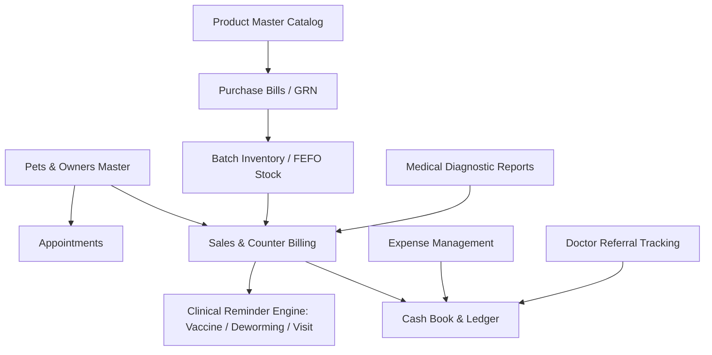

# Previous ERP (VetSync) System Analysis & Harmony ERP Integration Specification

> **Document Version**: 1.0  
> **Source Directory**: `previous erp-20260823T163407Z-1-001/previous erp/`  
> **Purpose**: Comprehensive technical audit of the legacy VetSync ERP system based on 22 operational screenshots, documenting all database schemas, form inputs, validation rules, financial workflows, and direct parameter mappings for the **Harmony ERP Suite**.

---

## 1. Executive Architectural Overview

The previous VetSync ERP system operates as an end-to-end clinical and commercial management system for veterinary practices. It unifies **Point of Sale (POS) Billing**, **Batch Inventory Management**, **Vendor Inwarding (Purchase Bills)**, **Cash Flow Auditing**, **Diagnostic Lab Reports**, and **Referral Commissions**.

---

## 2. In-Depth Module Specifications & Input Parameters

### A. Sales, Counter Invoicing & Billing (Core Focus)

The legacy invoice engine combines commercial billing with clinical care scheduling and split payments.

#### 1. Invoice Header Fields
| Parameter | UI Control | Data Type | Validation / Options | Description |
| :--- | :--- | :--- | :--- | :--- |
| `invoiceNo` | Read-only | `String` | e.g., `INV/2026-27/905` | Auto-sequenced financial year invoice ID |
| `date` | Date Picker | `YYYY-MM-DD` | Required | Transaction date |
| `branch` | Dropdown | `String` | e.g., `Perfect Society` | Branch / Clinic location |
| `billType` | Toggle / Select | `Enum` | `GST` \| `Non-GST` | Controls GST tax breakdown calculation and invoice print layout |
| `petName` | Autocomplete | `String` | Required | Linked patient record |
| `ownerName` | Autocomplete | `String` | Required | Customer / Owner name |
| `nextVisitDate` | Date Picker | `DD/MM/YYYY` | Optional | Scheduled checkup / follow-up reminder |
| `nextVaccineDate`| Date Picker | `DD/MM/YYYY` | Optional | Next scheduled vaccination date |
| `nextDewormingDate`| Date Picker| `DD/MM/YYYY` | Optional | Next routine deworming date |

#### 2. Line Items (Categorized Structure)
Invoice items are partitioned into distinct operational categories to facilitate clinical reporting:
* **Category Partitioning**:
  * `Vaccine` (e.g., *Canishot DHPPIL*, *Canishot CV*, *Nobivac R*, *Bronx*)
  * `Consultation & Procedures` (e.g., *General OPD*, *Emergency Care*, *Surgical Procedure*)
  * `Pharmacy & Medicines` (e.g., *Aceptor-5 Tab*, *Advaplat 200ml Syrup*, *Advocate 25-40kg*)
  * `Diagnostic Tests` (e.g., *Complete Blood Count (CBC)*, *Serum Biochemistry*)
  * `Services & Daycare` (e.g., *Pet Boarding*, *Hydrotherapy / Spa*)
* **Line Item Parameters**:
  * `itemName`: Item / Medicine / Service Name
  * `quantity`: Numeric (integer or float for liquids)
  * `unitPrice`: Selling rate in ₹
  * `discountPercent`: Inline line discount percentage (`0% - 100%`)
  * `lineTotal`: `(quantity * unitPrice) * (1 - discountPercent / 100)`

#### 3. Payment Settlement & Accounting Breakdown
* **Multi-Mode Payment Log**:
  * `srNo`: Serial sequence
  * `timestamp`: Date and time of payment
  * `paymentMode`: `UPI` | `Cash` | `Card` | `NetBanking` | `Cheque` | `Account Credit`
  * `amount`: Partial or full settled amount
* **Invoice Summary Computations**:
  $$\text{Subtotal} = \sum \text{Line Totals}$$
  $$\text{Bill Discount} = \text{Subtotal} \times \text{Discount Rate}$$
  $$\text{Taxable Value} = \text{Subtotal} - \text{Bill Discount}$$
  $$\text{GST Amount} = \text{Taxable Value} \times \text{GST Rate (if GST bill)}$$
  $$\text{Round-off} = \text{Rounded Total} - \text{Exact Total}$$
  $$\text{Total Amount} = \text{Taxable Value} + \text{GST Amount} + \text{Round-off}$$
  $$\text{Balance Due} = \text{Total Amount} - \text{Total Paid}$$

#### 4. Invoice Actions
* `Download PDF`: Prints a formatted A4 / 80mm thermal receipt with clinic header and next visit schedule.
* `Edit`: Modifies open / unfinalized invoices.
* `Delete`: Administrative deletion with audit log and stock restoral.

---

### B. Purchase Bills & Vendor Inwarding (GRN)

Acts as the official Goods Received Note (GRN) that increases inventory batches and creates accounts payable entries.

#### 1. Supplier & Invoice Header
* `supplierName`: Vendor / Pharmaceutical distributor (e.g., *Sava Vet*, *Elanco*, *Vetoquinol*)
* `purchaseDate`: Date of inwarding (`DD/MM/YYYY`)
* `contactNumber`: Vendor telephone / mobile number
* `billNo`: Supplier's tax invoice number

#### 2. Item Inwarding Form (Batch Generation)
* `itemName` & `brandName`: Product nomenclature
* `category`: `Medicine` | `Consumables` | `Surgical` | `Food/Nutrition`
* `unit`: `Tablet` | `Bottle` | `Strip` | `Vial` | `Ampoule` | `Unit`
* `batchNumber`: Manufacturer batch string (e.g., `TSVATM5001`, `RLI25305`)
* `purchaseDate` & `expiryDate`: Critical for **First-Expiry-First-Out (FEFO)** dispatch
* `quantity`: Units received
* `purchasePrice`: Cost price per unit (ex-tax or inclusive)
* `salePrice`: Standard retail selling price (MRP)
* `gstRate`: Applicable input GST credit (`0%`, `5%`, `12%`, `18%`, `28%`)

#### 3. Purchase Bill Payment Details
* `paidStatus`: `Pending` | `Paid` | `Partial`
* `paymentMode`: `UPI` | `Cash` | `Bank Transfer / Cheque` | `Card`
* `trxRefNo`: Transaction / Cheque reference number
* `discount`: Cash discount received from distributor
* `subtotal`, `gstTotal`, and `grandTotal`

---

### C. Inventory & Product Master Catalog

The legacy system enforces a dual-tier inventory structure:

1. **Master Product Catalog (`Manage Products`)**:
   * Global definition of product attributes: `Item Name`, `Brand Name`, `Category`, `Unit`, `Base Purchase Price`, `Base Sale Price`, `GST %`, `Reorder Level`.
2. **Batch Stock Inventory (`Inventory Management`)**:
   * Physical stock on shelves tracked by individual batch codes and expiry dates.
   * **Filter Thresholds**:
     * `All Categories` filter
     * `Low Stock`: Filter items where $\text{Current Stock} \le \text{Reorder Level}$
     * `Expiring Soon`: Filter items where $\text{Expiry Date} \le \text{Current Date} + 60\text{ days}$
   * **KPI Summary Header**:
     * `Total Items`: Total unique SKUs
     * `Low Stock`: Count of products requiring purchase reorder
     * `Expiring Soon`: Count of batches nearing expiry
     * `Stock Value`: Total monetary valuation ($\sum \text{Stock} \times \text{Purchase Price}$)

---

### D. Cash Book & Daily Finance Audit

Provides daily cash drawer auditing and petty cash control.

#### 1. Daily Transaction Ledger
* Columns: `SR No.`, `Date`, `Particulars / Narration`, `Type` (`Sale Payment`, `Purchase Bill`, `Expense`, `Adjustment`), `Debit (Out)`, `Credit (In)`.
* **Quick Metrics Sidebar**:
  * `Total Cash Inflow` (Receipts from billing & counter sales)
  * `Total Cash Outflow` (Disbursements for suppliers & expenses)
  * `Net Cash Flow` ($\text{Inflow} - \text{Outflow}$)
  * `Opening Balance` & `Closing Balance`
* **Category Monthwise Breakdown**:
  * `expense`
  * `purchase_bill`
  * `sale_payment`
* **Special Actions**:
  * `+ Adjustment Entry`: Allows recording manual adjustments for physical drawer count reconciliation.
  * `Export to Excel`: Generates spreadsheet of filtered date range.

---

### E. Expense Management

Tracks all operational and overhead clinic costs separate from inventory purchases.

* **KPI Summary**: `Total Expenses`, `Cash Expenses`, `Bank / Card Expenses`, `Top Spending Category`.
* **Form Inputs**:
  * `Date`: Date expense was incurred
  * `Type / Category`: `Clinic Expenditure`, `Rent`, `Salaries`, `Utilities`, `Repairs & Maintenance`, `Staff Welfare`
  * `Paid To`: Beneficiary / Vendor name (e.g., *Electrician*, *Landlord*, *Plumber*)
  * `Payment Mode`: `Cash` | `UPI` | `Cheque` | `Card`
  * `Paid By`: Clinic administrator / Doctor ID
  * `Remarks`: Detailed explanation (e.g., *"for lift machine electric wiring"*, *"AC repair"*)
  * `Amount`: Expense amount in ₹

---

### F. Clinical & Diagnostic Modules

#### 1. Medical Diagnostic Reports
* **Header & Specimen Info**:
  * `Pet Name`: Patient autocomplete
  * `Sample Collected Date` & `Sample Processed Date`
  * `Species`: Canine, Feline, Avian, Exotic
  * `Test Template`: CBC, Liver Function Test (LFT), Kidney Function Test (KFT), Urinalysis, Skin Scraping
  * `Reference Doctor / Clinic`
  * `Clinical Remarks`
* **Parameter Results Grid**:
  * `Test Parameter Name` (e.g., *Hemoglobin*, *WBC Count*, *Platelets*, *Creatinine*)
  * `Test Result`: Numeric or qualitative value
  * `Standard Biological Reference Range` (e.g., `12.0 - 18.0 g/dL`)
  * `Units`: (e.g., `g/dL`, `10^3/uL`, `mg/dL`)

#### 2. Doctor Referral Commissions
* **Metrics**: `Total Referrals`, `Test Revenue`, `Total Commission Payable`, `Pending Payments`.
* **Ledger Columns**:
  * `Sr. No.`, `Date`, `Pet / Owner`, `Test Type`, `Referring Doctor`, `Test Amount (₹)`, `Commission (₹ / %)`, `Clinic Net Revenue (₹)`, `Payment Status (Pending / Settled)`.

#### 3. Staff & Payroll Management
* `Name`, `Department` (`Front Office`, `Housekeeping`, `Clinical`, `Management`), `Designation`, `Email`, `Phone`, `Address`, `Join Date`, `Monthly Salary (₹)`.

---

## 3. Harmony ERP Suite Integration Plan

To implement these legacy capabilities into our Harmony ERP Suite without losing existing advanced multi-warehouse and MongoDB double-entry functionality, the following updates are mapped:

| Target Component in Harmony ERP | Updates to Incorporate from VetSync Spec |
| :--- | :--- |
| **`BillingSync.tsx` / Sales View** | 1. Add clinical reminder inputs: `Next Visit Date`, `Next Vaccine Date`, `Next Deworming Date`, and `Branch`. 2. Support category-grouped line items (`Vaccines`, `Consultation`, `Pharmacy`, `Procedures`). 3. Provide multi-mode split payment logging with change calculation. |
| **`StockView.tsx` / `ItemDetailView.tsx`** | 1. Add `Expiring Soon (60d)` and `Low Stock` instant filter chips. 2. Include Reorder Threshold warnings in the stock master list. 3. Ensure batch purchase and sale prices sync with FEFO dispatch. |
| **`FinancialDashboard.tsx` & Reports** | 1. Integrate Cash Book Inflow vs Outflow daily tracking. 2. Add Monthwise categorization split (`Sales Receipts`, `Vendor Bills`, `Direct Expenses`). |
| **Print / PDF Invoicing Engine** | 1. Output a clinical receipt containing clinic details, patient UID, next vaccination date, category itemization, and GST summary. |

---

*This specification serves as the blueprint for extending the Billing, Invoicing, and Inventory workflows in Harmony ERP.*
