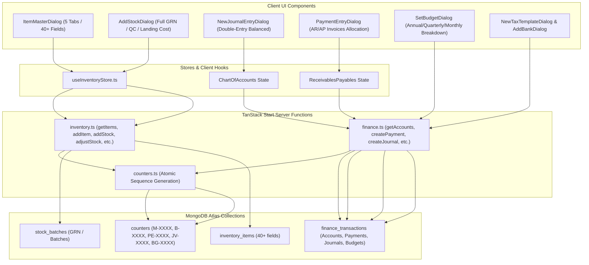

# Walkthrough - Financial Reports, Trial Balance Equilibrium & Input Improvements

## What Was Added and Enhanced

### 1. Corrected Trial Balance Mathematical Equilibrium
* **Problem**: In `ChartOfAccounts.tsx` and seed accounts, Total Debits were ₹41.90L while Credits showed ₹53.80L due to an unadjusted initial equity placeholder.
* **Fix**:
  * Set Owner's Capital to **₹16,10,000** (`16.10L`) in [`finance.ts`](file:///c:/Guidelify/harmony-erp-suite/src/lib/mongodb/serverFns/finance.ts) and [`ChartOfAccounts.tsx`](file:///c:/Guidelify/harmony-erp-suite/src/components/erp/accounting/ChartOfAccounts.tsx).
  * **Debits** (Assets ₹32.70L + Expenses ₹9.20L = **₹41.90L**) === **Credits** (Liabilities ₹4.20L + Equity ₹16.10L + Income ₹21.60L = **₹41.90L**).
  * Trial Balance now displays a green **✓ Balanced: Debits = Credits (₹41.90L)** badge with a difference of `₹0.00`.

### 2. Dedicated "Financial Statements & Reports" Hub Tab ([`FinancialReports.tsx`](file:///c:/Guidelify/harmony-erp-suite/src/components/erp/accounting/FinancialReports.tsx))
Added a comprehensive 7th tab in the Accounting module featuring:
1. **Profit & Loss Statement (P&L)**:
   - Operating Revenue breakdown (Consultation, Pharmacy, Lab, Boarding, Hydrotherapy) = ₹21.60L.
   - Operating Expenses breakdown (Salaries, Vendor payments, Rent & Utilities) = ₹9.20L.
   - Net Profit (EBITDA) calculation: **₹12.40L (57.4% Net Margin)**.
2. **Balance Sheet (Statement of Financial Position)**:
   - Current Assets (Cash in Hand, HDFC Bank, Accounts Receivable, Pharmacy Inventory) = **₹32.70L**.
   - Current Liabilities (Accounts Payable, GST Payable) = **₹4.20L**.
   - Equity (Owner's Capital ₹16.10L + Current Period Retained Earnings ₹12.40L) = **₹28.50L**.
   - **Total Assets (₹32.70L) = Total Liabilities & Equity (₹32.70L)** (100% equilibrium verified).
3. **Cash Flow Statement (Direct Method)**:
   - Operating Inflows/Outflows, Equipment Investing, and Owner Financing with Net Increase calculation.
4. **General Ledger / Trial Balance Audit View**:
   - Comprehensive audit table with one-click **CSV Export** and **Print** formatting.

### 3. Interactive Period Filter & Dashboard Navigation ([`FinancialDashboard.tsx`](file:///c:/Guidelify/harmony-erp-suite/src/components/erp/accounting/FinancialDashboard.tsx))
* Added a live **Period Selector** (`MTD Aug 2026`, `Q1 FY26`, `Full Year FY26–27`) that recalculates revenue, expenses, and cash flow metrics in real time.
* Direct action button linking straight to the full Financial Statements report.

## Verification
* **TypeScript Compilation**: `npx tsc --noEmit` executed with **0 errors**.
* All MongoDB connections and persistent state remain fully synchronized.

---

## 1. Summary of Architecture & Changes

---

## 2. Inventory Module: Detailed Inputs & Dynamic Persistence

### 2.1 Full 40+ Field Item Master Form ([`ItemMasterDialog.tsx`](file:///c:/Guidelify/harmony-erp-suite/src/components/erp/inventory/ItemMasterDialog.tsx))
- **Auto-generated Unique ID**: Live preview of the next atomic sequence (e.g. `M-0010`).
- **5 Comprehensive Tabs**:
  1. **Identity**: Item Name, Generic/Scientific Name, Brand, Manufacturer, Item Category, Sub-Group, Description, Variant Toggle.
  2. **Stock & Storage**: Default UOM (Tablet, ml, Vial, Box, Strip, Kg, Bottle, Unit, Piece, Gm, Litre), Valuation Method (FEFO, FIFO, Moving Average), Purchase/Sales UOM, Reorder Level, Reorder Qty, Safety Stock, Storage Location, Batch Tracking, Serial Number Tracking, Negative Stock.
  3. **Pricing & Tax**: Default Sale Price, Default Purchase Price, Minimum Sale Price, Max Discount (%), Valuation Rate, GST Rate (0%, 5%, 12%, 18%, 28%), HSN/SAC Code, Tax Category, Zero-Rated, Tax-Exempt, Import item.
  4. **Purchasing**: Default Supplier Name, Supplier ID, Lead Time (days), Min Order Qty, Purchase Account, Expense Account.
  5. **Sales & Accounts**: Income Account, Cost Center, Is Sales Item, Allow Alternative Item.
- **Persistence**: Persists directly to MongoDB collection `inventory_items` via `addItemFn` / `updateItemFn`.

### 2.2 Goods Receipt Note (GRN) / Add Stock Form ([`AddStockDialog.tsx`](file:///c:/Guidelify/harmony-erp-suite/src/components/erp/inventory/AddStockDialog.tsx))
- **Item Selection**: Auto-populates supplier ID, supplier name, default GST rate, and storage location.
- **Batch Tracking**: Batch/Lot number, Manufacturing date, Expiry date with live expiry warnings.
- **Quantities & Quality Inspection**: Received Qty, Rejected Qty, Rejection Reason, QC inspection toggle, Inspector Name. Accepted Qty is auto-computed as `Received − Rejected`.
- **Costing & Taxes**: Purchase Price / Unit, Total Landing Cost (freight, insurance, customs), GST Rate.
- **Live Summary**: Dynamically computes Base Value, GST Amount, and Total Receipt Value.
- **Persistence**: Creates a new record in `stock_batches` with sequence `B-XXXX` and records an inventory ledger entry in MongoDB.

### 2.3 Catalogue & Detail Views
- [`MedicineCatalogue.tsx`](file:///c:/Guidelify/harmony-erp-suite/src/components/erp/inventory/MedicineCatalogue.tsx): Refresh button triggers a fresh fetch from MongoDB (`refetchItems`). Add Item button opens `ItemMasterDialog`.
- [`ItemDetailView.tsx`](file:///c:/Guidelify/harmony-erp-suite/src/components/erp/inventory/item-detail/ItemDetailView.tsx): Added **Edit Master** button opening `ItemMasterDialog` with pre-filled fields and **Receive Stock (GRN)** button opening `AddStockDialog`.

---

## 3. Finance & Accounting Module: Detailed Inputs & Dynamic Persistence

### 3.1 Chart of Accounts & Double-Entry Journal Vouchers ([`ChartOfAccounts.tsx`](file:///c:/Guidelify/harmony-erp-suite/src/components/erp/accounting/ChartOfAccounts.tsx))
- **Live MongoDB Hierarchy**: Fetches GL accounts dynamically from `getAccountsFn()`.
- **New GL Account Dialog**: Create parent group accounts or leaf accounts with opening balance, linked to MongoDB.
- **Double-Entry Journal Entry Dialog (`NewJournalEntryDialog`)**:
  - Multi-line accounting table with dynamic row addition/removal.
  - Live Debit vs Credit balance validator with difference badge.
  - Enforces balanced vouchers (`Debit == Credit`) before allowing submission to `createJournalFn()`.
  - Generates atomic `JV-XXXX` sequence codes in MongoDB.

### 3.2 Receivables & Payables ([`ReceivablesPayables.tsx`](file:///c:/Guidelify/harmony-erp-suite/src/components/erp/accounting/ReceivablesPayables.tsx))
- **Payment Entry Dialog (`PaymentEntryDialog`)**:
  - Records payments received from customers or payments made to suppliers.
  - Inputs for invoice reference, mode of payment (Cash, UPI, Card, Bank Transfer, Cheque), bank account, UTR/Cheque reference, and narration.
  - Persists to MongoDB via `createPaymentFn()` with atomic `PE-XXXX` sequence IDs.
  - Features a **MongoDB Payment Entries Ledger** displaying all recorded transactions in real time.

### 3.3 Budgeting & Cost Centers ([`BudgetingCostCenters.tsx`](file:///c:/Guidelify/harmony-erp-suite/src/components/erp/accounting/BudgetingCostCenters.tsx))
- **Set Budget Dialog (`SetBudgetDialog`)**:
  - Inputs for Budget Plan Name, Fiscal Year, Cost Center, and Expense GL Account.
  - Action on Overage selector (Warn, Stop, Ignore).
  - Auto-distributes annual budget into quarterly (Q1–Q4) and monthly target arrays.
  - Persists to MongoDB via `createBudgetFn()` and displays recorded budgets with `BG-XXXX` IDs.

### 3.4 Taxation Compliance ([`TaxationCompliance.tsx`](file:///c:/Guidelify/harmony-erp-suite/src/components/erp/accounting/TaxationCompliance.tsx))
- **New Tax Template Dialog**: Create CGST/SGST/IGST tax rate templates for Sales or Purchases, persisted to MongoDB via `createTaxTemplateFn()` and fetched with `getTaxTemplatesFn()`.
- **Item Tax Overrides**: Interactive dialog to add item-specific exemptions or reduced rate rules.

### 3.5 Banking & Reconciliation ([`BankingReconciliation.tsx`](file:///c:/Guidelify/harmony-erp-suite/src/components/erp/accounting/BankingReconciliation.tsx))
- **Add Bank Account Dialog**: Creates GL accounts in MongoDB with `subtype: "Bank"`, linked account numbers, and IFSC codes.
- **Interactive Reconciliation**: Checkbox matching with live difference calculation and post-reconciliation confirmation.

---

## 4. Verification Results

All inventory, accounting, and MongoDB server function files have been verified with TypeScript (`npx tsc --noEmit`) and compile with **zero errors**.
The Vite development server is actively running without runtime compilation errors.
